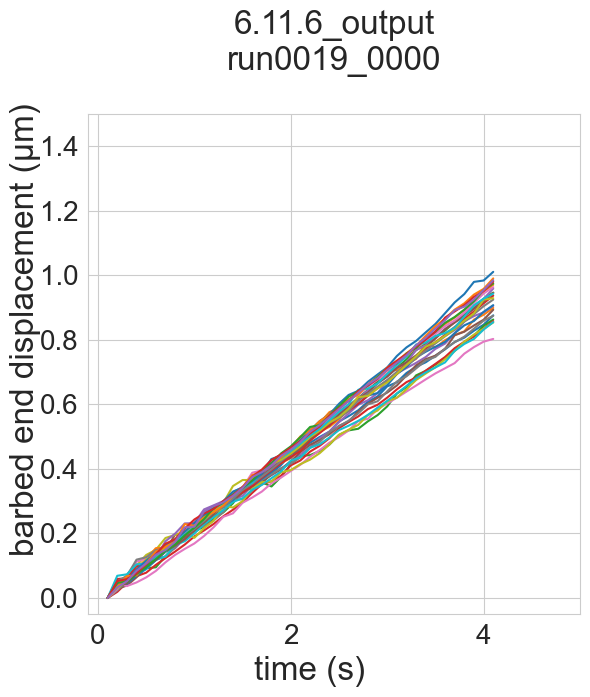

# Table of Contents

1.  [export this to other file formats](#org981132f)
    1.  [convert to jupyter notebook](#org2573baa)
        1.  [using pandoc](#org68f05ed)
        2.  [using orgparse](#orgd3757ec)
    2.  [export to org document](#orgee58537)
    3.  [export to markdown document](#orge46a246)
2.  [figure generation index](#org782d634)
3.  [configuration](#org4b7b984)
    1.  [set global variables](#org709f0d9)
    2.  [load and configure libraries](#org2559ff3)
    3.  [set working directories](#orgec9cc7e)
    4.  [load custom functions](#org04adb90)
4.  [find directories that have outputs or config files](#org20643e8)
5.  [report simulations](#org9922436)
6.  [read simulation properties](#orgc923050)
    1.  [put all properties and configs into dataframes](#org2a3798d)
    2.  [filter for properties that vary among simulations](#org09047bb)
7.  [parse results into dataframe](#orgd56305a)
    1.  [fiber ends](#org04aa112)
8.  [load in previously parsed dataframes](#org233edde)
9.  [plot results](#org866b628)
    1.  [actin plus end displacement](#orgd8583a2)
        1.  [all parameters](#orgd7fc3f1)
        2.  [final myo parameters](#org76fb487)

# export this to other file formats

These files are symbolically linked such that their source is the
version-controlled directory, but they can be exported from the local directory
where the analysis happens

Due to this difference in directory structure, anyone else using these scripts
will have to make sure the locations of their data are specified correctly in
the [set working directories](#orgec9cc7e) section.

## convert to jupyter notebook

### using pandoc

this looks nice but it&rsquo;s just a big markdown block

    pandoc 6.11.6_analysis.org -o gliding_analysis_pandoc.ipynb

### using orgparse

this is the only way that makes runnable python cells, though lots of formatting
doesn&rsquo;t work

    import orgparse
    import nbformat as nbf
    import re
    import base64
    
    def parse_results(results_block):
        """
        Parse the #+RESULTS: block to extract outputs.
        """
        outputs = []
        lines = results_block.strip().split("\n")
    
        for line in lines:
            if line.strip().startswith(": "):
                outputs.append(nbf.v4.new_output(output_type="stream", name="stdout", text=line[2:].strip() + "\n"))
            elif re.match(r"\[\[.*\.(png|jpg|jpeg|gif)\]\]", line.strip()):
                image_path = re.search(r"\[\[(.*\.(png|jpg|jpeg|gif))\]\]", line.strip()).group(1)
                try:
                    with open(image_path, "rb") as f:
                        image_data = base64.b64encode(f.read()).decode("utf-8")
                    outputs.append(nbf.v4.new_output(
                        output_type="display_data",
                        data={"image/png": image_data},
                        metadata={}
                    ))
                except FileNotFoundError:
                    print(f"Warning: Image file not found: {image_path}")
        return outputs
    
    def convert_org_links_to_markdown(text):
        """
        Convert Org mode links to Markdown links.
        """
        text = re.sub(r"\[\[([^\]]+)\]\[([^\]]+)\]\]", r"[\2](\1)", text)
        text = re.sub(r"\[\[([^\]]+)\]\]", r"[\1](\1)", text)
        return text
    
    def org_to_ipynb(org_file, ipynb_file):
        org = orgparse.load(org_file)
        nb = nbf.v4.new_notebook()
        cells = []
    
        for node in org[1:]:
            if ":noexport:" in node.tags or (node.heading and ":noexport:" in node.heading.lower()):
                continue
    
            if node.heading:
                heading_level = "#" * node.level
                cells.append(nbf.v4.new_markdown_cell(f"{heading_level} {node.heading}"))
    
            in_code_block = False
            in_results_block = False
            code_lines = []
            markdown_lines = []
            results_block = ""
    
            for line in node.body.split("\n"):
                if line.strip().startswith("#+BEGIN_SRC python"):
                    in_code_block = True
                    if markdown_lines:
                        markdown_text = convert_org_links_to_markdown("\n".join(markdown_lines)).strip()
                        if markdown_text:
                            cells.append(nbf.v4.new_markdown_cell(markdown_text))
                        markdown_lines = []
                    continue
                elif line.strip().startswith("#+END_SRC"):
                    in_code_block = False
                    if code_lines:
                        code_cell = nbf.v4.new_code_cell("\n".join(code_lines))
                        cells.append(code_cell)
                        code_lines = []
                    continue
                elif line.strip().startswith("#+RESULTS:"):
                    in_results_block = True
                    continue
                elif in_results_block and line.strip() == ":end:":
                    in_results_block = False
                    if results_block.strip():
                        outputs = parse_results(results_block)
                        if outputs and cells:
                            cells[-1].outputs = outputs
                    results_block = ""
                elif in_code_block:
                    code_lines.append(line)
                elif in_results_block:
                    results_block += line + "\n"
                else:
                    markdown_lines.append(convert_org_links_to_markdown(line))
    
            markdown_text = convert_org_links_to_markdown("\n".join(markdown_lines)).strip()
            if markdown_text:
                cells.append(nbf.v4.new_markdown_cell(markdown_text))
    
        nb.cells = cells
        with open(ipynb_file, "w") as f:
            nbf.write(nb, f)
    
    # Convert your Org file
    org_to_ipynb("6.11.6_analysis.org",
                 "gliding_analysis_orgparse.ipynb")

    (org-babel-tangle)

    c692b3bc6302671c75bffbd145877bfc

    python convert_org_to_ipynb.py

## export to org document

    (org-org-export-to-org)

    25bd31980825939f59716e42a7f65351

## export to markdown document

    (org-md-export-to-markdown)

    6e4588c0990cca7fb6ad29f883d8fb96

# figure generation index

<table>

<colgroup>
<col  class="org-left">

<col  class="org-left">

<col  class="org-left">
</colgroup>
<thead>
<tr>
<th scope="col" class="org-left">figure</th>
<th scope="col" class="org-left">panel</th>
<th scope="col" class="org-left">link</th>
</tr>
</thead>
<tbody>
<tr>
<td class="org-left">S2</td>
<td class="org-left">D</td>
<td class="org-left"><a href="#org76fb487">final myo parameters</a></td>
</tr>
</tbody>
</table>

# configuration

## set global variables

    #timestep = 5e-5
    report = 'no'
    replace_movies = 'no'
    save_figures = 'yes'
    save_dataframes = 'yes'

## load and configure libraries

    import os
    import sys
    from tabulate import tabulate
    import math
    import numpy as np
    import pandas as pd
    import shutil
    import subprocess
    from subprocess import Popen
    import datetime
    import matplotlib.pyplot as plt  # plotting
    import seaborn as sns  # nicer plotting
    from decimal import Decimal
    import matplotlib.colors as mplcolors
    import matplotlib
    from matplotlib.colors import LogNorm
    from matplotlib.colors import SymLogNorm
    from matplotlib.cm import ScalarMappable
    from scipy.stats import binned_statistic_2d
    from scipy import stats
    from scipy.signal import savgol_filter
    from scipy.signal import find_peaks
    import textwrap
    from decimal import Decimal
    from scipy.stats import binned_statistic_2d
    from matplotlib.font_manager import FontProperties
    import matplotlib.pyplot as plt  # plotting
    import matplotlib.colors as mcolors
    from matplotlib.colors import LogNorm
    from matplotlib.colors import SymLogNorm
    plt.style.use('seaborn-v0_8-colorblind') # set plot style
    plt.cool()                          # heatmap color scheme
    matplotlib.rcParams['axes.prop_cycle'] = matplotlib.cycler(color=mcolors.TABLEAU_COLORS)
    %matplotlib inline
    
    import seaborn as sns  # nicer plotting
    sns.set_style('whitegrid')  # set plot style
    
    SMALL_SIZE = 20
    MEDIUM_SIZE = 24
    BIGGER_SIZE = 30
    
    plt.rc('font', size=SMALL_SIZE)          # controls default text sizes
    plt.rc('axes', titlesize=MEDIUM_SIZE)     # fontsize of the axes title
    plt.rc('axes', labelsize=MEDIUM_SIZE)    # fontsize of the x and y labels
    plt.rc('xtick', labelsize=SMALL_SIZE)    # fontsize of the tick labels
    plt.rc('ytick', labelsize=SMALL_SIZE)    # fontsize of the tick labels
    plt.rc('legend', fontsize=SMALL_SIZE)    # legend fontsize
    plt.rc('figure', titlesize=BIGGER_SIZE)  # fontsize of the figure title
    plt.rc('figure', figsize=[6,5]) # default figure width, height
    
    now = datetime.datetime.now()
    date = now.strftime('%Y%m%d')
    pref = date

    /home/maxferrin/miniconda3/lib/python3.10/site-packages/pandas/core/arrays/masked.py:60: UserWarning: Pandas requires version '1.3.6' or newer of 'bottleneck' (version '1.3.5' currently installed).
      from pandas.core import (
    <Figure size 640x480 with 0 Axes>

## set working directories

    #machine = 'peeks'
    machine = 'ltpbukem'
    
    if machine == 'ltpbukem':
        drive_dir = '/home/maxferrin/google_drive/'
    
    if machine == 'bizon':
        drive_dir = '/media/bizon/DATA/MFerrin/insync/'
    
    if machine == 'peeks':
        drive_dir = '/scratch/ferrin/unison_peeks/'
    
    if machine == 'drumroom':
        drive_dir = '/Users/max/google_drive/'
    
    if machine == 'mbp':
        drive_dir = '/Users/maxferrin/google_drive/'
    
    if machine == 'sobarky':
        drive_dir = '/Users/dblab/google_drive/'
    
    
    working_dir = os.path.join(drive_dir, 'grad_school/db_lab/code/analysis/6.11.6_temp/')
    cytosim_dir = os.path.join(drive_dir, 'grad_school/db_lab/code/cytosim_dblab/', machine)
    
    if machine == 'peeks':
        working_dir = '/run/media/ferrin/Volume/max/analysis/6.11.6_temp/'
        cytosim_dir = '/home/ferrin/cytosim/'
    
    dataframes_dir = os.path.join(working_dir,'dataframes/')
    
    os.chdir(working_dir)
    
    if os.path.isdir('figures') == False:
        os.mkdir('figures')
    if os.path.isdir('dataframes') == False:
        os.mkdir('dataframes')

## load custom functions

    # add parent folder to path
    sys.path.insert(1, '../')
    from cytosim_analysis import cytosim_analysis_functions as caf
    
    # reload custom library
    from importlib import reload
    reload(sys.modules['cytosim_analysis'])

    <module 'cytosim_analysis' from '/home/maxferrin/SynologyDrive/google_drive/grad_school/db_lab/code/analysis/6.11.6_temp/../cytosim_analysis/__init__.py'>

# find directories that have outputs or config files

    output_dirs, config_dirs = caf.find_directories()
    print(output_dirs, config_dirs)

    ['6.11.6_output'] ['6.11.6']

# report simulations

this crashes

    solid_allruns_allparams, properties_allruns_allparams, \
    configs_allruns_allparams, single_hip1r_allruns_allparams, \
    single_membrane_myosin_allruns_allparams, fiber_forces_allruns_allparams, \
    fiber_clusters_allruns_allparams, fiber_tensions_allruns_allparams, \
    fiber_ends_allruns_allparams, rundirs_allparams, total_runs = \
    caf.report_sims(working_dir, output_dirs, config_dirs, cytosim_dir,
    report, replace_movies)

this is better

     properties_allruns_allparams, configs_allruns_allparams, \
     fiber_ends_allruns_allparams, rundirs_allparams, \
     total_runs = caf.report_fiber_ends(
         working_dir, output_dirs, config_dirs,
         cytosim_dir, report, replace_movies)
    
    rundirs_allparams_df = pd.DataFrame.from_dict(rundirs_allparams, orient = 'index')
    if save_dataframes == 'yes':
        rundirs_allparams_df.to_pickle(dataframes_dir+'rundirs_allparams.pkl')

    finished reporting 6.11.6_output

# read simulation properties

## put all properties and configs into dataframes

    properties_allparams, config_allparams = caf.props_configs(
        output_dirs, rundirs_allparams_df,
        properties_allruns_allparams, configs_allruns_allparams)

## filter for properties that vary among simulations

    cols = list(properties_allparams)
    nunique = properties_allparams.apply(pd.Series.nunique)
    cols_to_drop = nunique[nunique == 1].index
    properties_unique = properties_allparams.drop(cols_to_drop, axis=1)
    #properties_unique = properties_unique.drop(labels='internalize_random_seed',axis=1)
    properties_unique.head()

<table>

<colgroup>
<col  class="org-left">
</colgroup>
<tbody>
<tr>
<td class="org-left">(&rsquo;6.11.6output&rsquo;, &rsquo;run00190000&rsquo;)</td>
</tr>
</tbody>
</table>

    cols = list(config_allparams)
    nunique = config_allparams.apply(pd.Series.nunique)
    cols_to_drop = nunique[nunique == 1].index
    config_unique = config_allparams.drop(cols_to_drop, axis=1)
    #config_unique = config_unique.drop(['membrane_myosin_position'], axis=1)
    config_unique = config_unique.astype('float')
    config_unique.head()

<table>

<colgroup>
<col  class="org-left">
</colgroup>
<tbody>
<tr>
<td class="org-left">(&rsquo;6.11.6output&rsquo;, &rsquo;run00190000&rsquo;)</td>
</tr>
</tbody>
</table>

# parse results into dataframe

## fiber ends

    ends_allparams = caf.get_fiber_ends_2d(output_dirs, rundirs_allparams_df, fiber_ends_allruns_allparams)
    
    if save_dataframes == 'yes':
        ends_allparams.to_pickle(dataframes_dir+'ends_allparams.pkl')
    
    ends_allparams.head()

    finished parsing 6.11.6_output

<table>

<colgroup>
<col  class="org-left">

<col  class="org-right">

<col  class="org-right">

<col  class="org-right">

<col  class="org-right">

<col  class="org-right">

<col  class="org-right">

<col  class="org-right">

<col  class="org-right">

<col  class="org-right">

<col  class="org-right">

<col  class="org-right">

<col  class="org-right">

<col  class="org-right">
</colgroup>
<thead>
<tr>
<th scope="col" class="org-left">&#xa0;</th>
<th scope="col" class="org-right">fiberid</th>
<th scope="col" class="org-right">length</th>
<th scope="col" class="org-right">minusstate</th>
<th scope="col" class="org-right">minusxpos</th>
<th scope="col" class="org-right">minusypos</th>
<th scope="col" class="org-right">minusxdir</th>
<th scope="col" class="org-right">minusydir</th>
<th scope="col" class="org-right">plusstate</th>
<th scope="col" class="org-right">plusxpos</th>
<th scope="col" class="org-right">plusypos</th>
<th scope="col" class="org-right">plusxdir</th>
<th scope="col" class="org-right">plusydir</th>
<th scope="col" class="org-right">plusrpos</th>
</tr>
</thead>
<tbody>
<tr>
<td class="org-left">(&rsquo;6.11.6output&rsquo;, &rsquo;run00190000&rsquo;, 0.1, 17)</td>
<td class="org-right">17</td>
<td class="org-right">5</td>
<td class="org-right">0</td>
<td class="org-right">2.97818</td>
<td class="org-right">5.08422</td>
<td class="org-right">0.98319</td>
<td class="org-right">0.18268</td>
<td class="org-right">0</td>
<td class="org-right">7.74348</td>
<td class="org-right">6.55944</td>
<td class="org-right">0.96617</td>
<td class="org-right">0.25792</td>
<td class="org-right">10.1483</td>
</tr>

<tr>
<td class="org-left">(&rsquo;6.11.6output&rsquo;, &rsquo;run00190000&rsquo;, 0.1, 14)</td>
<td class="org-right">14</td>
<td class="org-right">5</td>
<td class="org-right">0</td>
<td class="org-right">5.25302</td>
<td class="org-right">5.61874</td>
<td class="org-right">0.45285</td>
<td class="org-right">0.89159</td>
<td class="org-right">0</td>
<td class="org-right">8.63113</td>
<td class="org-right">9.27963</td>
<td class="org-right">0.73223</td>
<td class="org-right">0.68111</td>
<td class="org-right">12.6731</td>
</tr>

<tr>
<td class="org-left">(&rsquo;6.11.6output&rsquo;, &rsquo;run00190000&rsquo;, 0.1, 20)</td>
<td class="org-right">20</td>
<td class="org-right">5</td>
<td class="org-right">0</td>
<td class="org-right">2.36824</td>
<td class="org-right">9.47717</td>
<td class="org-right">0.9985</td>
<td class="org-right">-0.05465</td>
<td class="org-right">0</td>
<td class="org-right">7.35264</td>
<td class="org-right">9.20952</td>
<td class="org-right">0.97208</td>
<td class="org-right">-0.23451</td>
<td class="org-right">11.7846</td>
</tr>

<tr>
<td class="org-left">(&rsquo;6.11.6output&rsquo;, &rsquo;run00190000&rsquo;, 0.1, 6)</td>
<td class="org-right">6</td>
<td class="org-right">1</td>
<td class="org-right">0</td>
<td class="org-right">-3.85175</td>
<td class="org-right">-9.35898</td>
<td class="org-right">0.6247</td>
<td class="org-right">-0.78087</td>
<td class="org-right">0</td>
<td class="org-right">-3.07164</td>
<td class="org-right">-9.97737</td>
<td class="org-right">0.7782</td>
<td class="org-right">-0.62799</td>
<td class="org-right">10.4395</td>
</tr>

<tr>
<td class="org-left">(&rsquo;6.11.6output&rsquo;, &rsquo;run00190000&rsquo;, 0.1, 11)</td>
<td class="org-right">11</td>
<td class="org-right">5</td>
<td class="org-right">0</td>
<td class="org-right">0.19428</td>
<td class="org-right">-4.55316</td>
<td class="org-right">-0.89951</td>
<td class="org-right">-0.43688</td>
<td class="org-right">0</td>
<td class="org-right">-4.63631</td>
<td class="org-right">-5.75944</td>
<td class="org-right">-0.82545</td>
<td class="org-right">-0.56443</td>
<td class="org-right">7.39368</td>
</tr>
</tbody>
</table>

# load in previously parsed dataframes

    ends_allparams = pd.read_pickle(dataframes_dir+'ends_allparams.pkl')
    rundirs_allparams_df = pd.read_pickle(dataframes_dir+'rundirs_allparams.pkl')
    rundirs_allparams_df.fillna(value='empty', inplace=True)

# plot results

## actin plus end displacement

### all parameters

    num_plots = total_runs
    
    width = 6
    if width > num_plots:
        width = 1
    height = int(math.ceil(float(num_plots)/float(width)))
    
    #max_int = solid_allparams['internalization'].max()*1000
    
    # plt.figure(figsize=(4*width,3*height)) #width, height
    fig, ax = plt.subplots(nrows=height, ncols=width, sharex=True, sharey=True, figsize=(6*width,7*height))
    fig.add_subplot(111, frameon=False)
    plt.tick_params(labelcolor='none', top='off', bottom='off', left='off', right='off')
    plt.grid(False)
    fig.text(0.5, 0, 'time (s)', ha='center', size=24)
    fig.text(0, 0.5, 'barbed end displacement (μm)', va='center', rotation='vertical', size=24)
    
    plot_no = 0
    
    for output_dir in output_dirs:
        rundirs = rundirs_allparams[output_dir]
        for run in rundirs:
    
            props = config_allparams.loc[output_dir].loc[run]
            #viscosity = props['internalize.cym_viscosity']
            #hip1r_off = props['strongbinder_unbinding'].split(',')[0]
    
            plot_no += 1
    
            plt.subplot(height,width,plot_no) #height, width
            for fiber_id in range(1,26):
                xdisp = ends_allparams.loc[[output_dir], [run], :, [fiber_id]]['plus_xpos']-ends_allparams.loc[(output_dir, run, 0.1, fiber_id)]['plus_xpos']
                ydisp = ends_allparams.loc[[output_dir], [run], :, [fiber_id]]['plus_ypos']-ends_allparams.loc[(output_dir, run, 0.1, fiber_id)]['plus_ypos']
                disp = np.sqrt(np.square(xdisp) + np.square(ydisp))
                x = xdisp.reset_index()['time']
                y = disp
                plt.plot(x,y)
            plt.xlim(right = 5)
            plt.ylim(top = 1.5)
            # plt.xlabel('time (s)')
            # plt.ylabel('internalization (nm)')
    
            title = output_dir+'\n'+run+'\n'
            for prop in list(config_unique):
                title += prop + ' = ' + str(props[prop]) + '\n'
    
            # for prop, value in zip(config_groups, name):
            #     title += prop + ' = ' + str(value) + '\n'
    
    
            plt.title(title)
    
    plt.tight_layout()
    
    if save_figures == 'yes':
      plt.savefig(working_dir+'figures/'+pref+'_plusend_disp-vs-time_all.png')

    /tmp/ipykernel_84634/564072330.py:30: MatplotlibDeprecationWarning: Auto-removal of overlapping axes is deprecated since 3.6 and will be removed two minor releases later; explicitly call ax.remove() as needed.
      plt.subplot(height,width,plot_no) #height, width

### final myo parameters

    plt.figure(figsize=[6,5])
    
    for fiber_id in range(1,26):
        xdisp = ends_allparams.loc[['6.11.6_output'], ['run0019_0000'], :, [fiber_id]]['plus_xpos']-ends_allparams.loc[('6.11.6_output', 'run0019_0000', 0.1, fiber_id)]['plus_xpos']
        ydisp = ends_allparams.loc[['6.11.6_output'], ['run0019_0000'], :, [fiber_id]]['plus_ypos']-ends_allparams.loc[('6.11.6_output', 'run0019_0000', 0.1, fiber_id)]['plus_ypos']
        disp = np.sqrt(np.square(xdisp) + np.square(ydisp))
        x = xdisp.reset_index()['time']
        y = disp
        plt.plot(x,y)
    
    plt.xlabel('Time ($s$)')
    plt.ylabel('Barbed end\ndisplacement ($\mu m$)')
    plt.tight_layout()
    
    if save_figures == 'yes':
        plt.savefig(working_dir+'figures/publish/gliding_displacement.svg')

    config_allparams.loc[('6.11.6_output', 'run0019_0000')]

    bud_viscosity                                      1
    blobneck_viscosity                                 1
    glide_time_step                                0.001
    glide_viscosity                                  1.0
    glide_steric                                     1.0
    glide_display                            ( style=2 )
    cell_geometry                      ( periodic 10 10)
    cell_number                                    space
    actin_rigidity                                 0.041
    actin_segmentation                              0.01
    actin_display                                      {
    actin_line_width                                 2.0
    actin_line_style                                 1.0
    actin_point_size                                 8.0
    actin_point_style                                2.0
    actin_steric                                     1.0
    actin_steric_radius                            0.008
    myosin_binding_rate                              3.0
    myosin_binding_range                           0.004
    myosin_unbinding_rate                           67.6
    myosin_unbinding_force                         -3.67
    myosin_activity                               mighty
    myosin_max_speed                                 5.0
    myosin_stall_force                          100000.0
    myosin_limit_speed                               1.0
    myosin_display                { size=6; color=red; }
    membrane_myosin_hand                          myosin
    membrane_myosin_stiffness                       80.0
    membrane_myosin_activity                       fixed
    actin_number                                       5
    actin_length                                    10.0
    membrane_myosin_number                      10000000
    gliding_label                (100 pN/um stiffness -)
    gliding_point_size                               6.0
    gliding_style                                    2.0
    gliding_nb_steps                             60000.0
    gliding_nb_frames                              600.0
    Name: (6.11.6_output, run0019_0000), dtype: object

